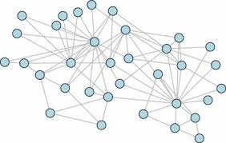

# Graph Neural Networks for Natural Language Processing

[](https://www.emnlp-ijcnlp2019.org/program/tutorials/)
[](https://shikhar-vashishth.github.io/assets/pdf/emnlp19_tutorial.pdf)
[](https://drive.google.com/drive/u/0/folders/1ljM-k34uYyI3Sp3IYGiZp_i5X1TgaYl1)

The repository contains code examples for [GNN-for-NLP](https://www.emnlp-ijcnlp2019.org/program/tutorials/) tutorial at [EMNLP 2019](https://www.emnlp-ijcnlp2019.org/). 

Slides can be downloaded from [here](https://shikhar-vashishth.github.io/assets/pdf/emnlp19_tutorial.pdf). 



### Dependencies

- Compatible with PyTorch 1.x, TensorFlow 1.x and Python 3.x.
- Dependencies can be installed using `requirements.txt`.

### TensorFlow Examples:

* `tf_gcn.py` contains simplified implementation of first-order approximation of GCN model proposed by [Kipf et. al. (2016)](https://arxiv.org/abs/1609.02907)
* Extensions of the same implementation for different problems:
  * Relation Extraction: [RESIDE](https://github.com/malllabiisc/RESIDE)
  * GCNs for Word Embeddings: [WordGCN](https://github.com/malllabiisc/WordGCN)
  * Document Time-stamping: [NeuralDater](https://github.com/malllabiisc/NeuralDater)

### PyTorch Examples:

* `pytorch_gcn.py` is pytorch equivalent of `tf_gcn.py` implemented using [pytorch-geometric](https://github.com/rusty1s/pytorch_geometric). 
* Several other examples are available [here](https://github.com/rusty1s/pytorch_geometric/tree/master/examples). 

### Additional Resources:

* Short writeup on theory behind Graph Convolutional Networks [[Pdf]](https://arxiv.org/abs/1911.03042) (refer Chapter-2).
* [GNN recent papers](https://github.com/naganandy/graph-based-deep-learning-literature).

### Citation:
Please cite the tutorial if you use this code in your work.

```bibtex
@inproceedings{vashishth-etal-2019-graph,
    title = "Graph-based Deep Learning in Natural Language Processing",
    author = "Vashishth, Shikhar  and
      Yadati, Naganand  and
      Talukdar, Partha",
    booktitle = "Proceedings of the 2019 Conference on Empirical Methods in Natural Language Processing and the 9th International Joint Conference on Natural Language Processing (EMNLP-IJCNLP): Tutorial Abstracts",
    month = nov,
    year = "2019",
    address = "Hong Kong, China",
    publisher = "Association for Computational Linguistics",
    abstract = "This tutorial aims to introduce recent advances in graph-based deep learning techniques such as Graph Convolutional Networks (GCNs) for Natural Language Processing (NLP). It provides a brief introduction to deep learning methods on non-Euclidean domains such as graphs and justifies their relevance in NLP. It then covers recent advances in applying graph-based deep learning methods for various NLP tasks, such as semantic role labeling, machine translation, relationship extraction, and many more.",
}
```
